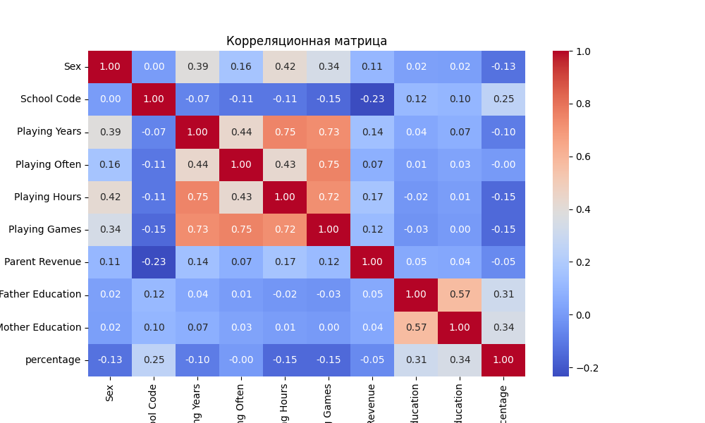

### Games and Students

**Project Goal:**  
To explore how gaming habits affect students' academic performance.

---

## Project Steps

**1. Data Cleaning**  
- **Issue:**  
  The `percentage` column contains incorrect values such as `"7750,00%"`. These will be corrected to the proper format, e.g., `77.5%` or `77.50`.

---

**2. Correlation Analysis** 

What we are looking for?

Strong correlations (values close to 1 or -1).

For example, a negative correlation between Playing House and Grade may mean that the more a student plays, the lower the grades.
- **Objective:**  
  Identify relationships between variables, such as how gaming habits influence academic success.


If **Playing Hours** and **Grade** have a correlation of **-0.65**, it means that the more time a student spends playing, the *lower* their academic grades tend to be.

If **Mother Education** and **Grade** correlate at **0.8**, this indicates a *strong relationship* between the mother's level of education and the student's academic performance.

---

**3. Data Splitting**  
- **Objective:**  
  Prepare data for machine learning by dividing it into training and testing sets.

---

**4. Model Training**  
- **Method:**  
  Train a model (e.g., linear regression) and assess its accuracy using the coefficient of determination \( R^2 \).

---

## Expected Outcomes

- Understand the impact of gaming habits on academic performance.
- Develop a model capable of predicting performance levels based on selected factors.

---

## How to Run the Project

1. Clone the repository:
   ```bash
   git clone https://github.com/your_repository/games_n_students.git
   ```

2. Install dependencies:
   ```bash
   pip install -r requirements.txt
   ```

3. Run the data analysis:
   ```bash
   python analysis.py
   ```

---
